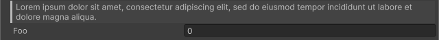

<!-- auto-generated by scripts/docs (dotnet run --project scripts/docs -- generate). Do not edit. -->

# Blockquote Attribute

Displays a quotation in the Inspector.

[!code-csharp]

| Parameter | Description |
| - | - |
| text | The text to display in the quotation. |
