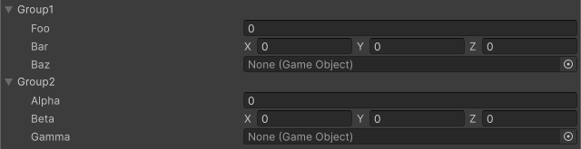

<!-- auto-generated by scripts/docs (dotnet run --project scripts/docs -- generate). Do not edit. -->

# Foldout Group Attribute

Creates collapsible groups for multiple members.

[!code-csharp]

| Parameter | Description |
| - | - |
| groupPath | Specifies the path of the group. Groups can be nested using `/`. |
| order | Drawing order among sibling groups and ungrouped members. Uses the same scale as `OrderAttribute`. Lower values are drawn first. Groups without an explicit order default to 0 (same as unordered members); ties are broken by declaration order. For nested paths (for example `A/B`), the order applies only to the leaf group (`B`). |
