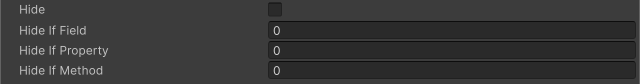

<!-- auto-generated by scripts/docs (dotnet run --project scripts/docs -- generate). Do not edit. -->

# Hide If Attribute

Hides the member in the Inspector when the specified condition evaluates to true.

[!code-csharp]

| Parameter | Description |
| - | - |
| condition | The name of the field, property, or method used to evaluate the condition. |
