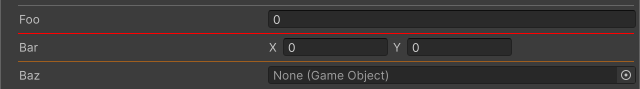

<!-- auto-generated by scripts/docs (dotnet run --project scripts/docs -- generate). Do not edit. -->

# Horizontal Line Attribute

Adds a horizontal line to the Inspector.

[!code-csharp]

| Parameter | Description |
| - | - |
| r | Red component of the line color. |
| g | Green component of the line color. |
| b | Blue component of the line color. |
| a | Alpha value of the line color. |
