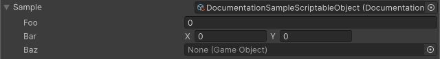

<!-- auto-generated by scripts/docs (dotnet run --project scripts/docs -- generate). Do not edit. -->

# Inline Editor Attribute

Displays the Inspector for the referenced ScriptableObject or component inline, allowing it to be edited in place.

[!code-csharp]
