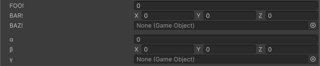

<!-- auto-generated by scripts/docs (dotnet run --project scripts/docs -- generate). Do not edit. -->

# Label Text Attribute

Overrides the label text of the field.

[!code-csharp]

| Parameter | Description |
| - | - |
| text | The text to display on the field label. |
