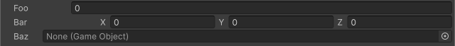

<!-- auto-generated by scripts/docs (dotnet run --project scripts/docs -- generate). Do not edit. -->

# Label Width Attribute

Sets the width of the field label.

[!code-csharp]

| Parameter | Description |
| - | - |
| width | The width of the label in pixels. |
