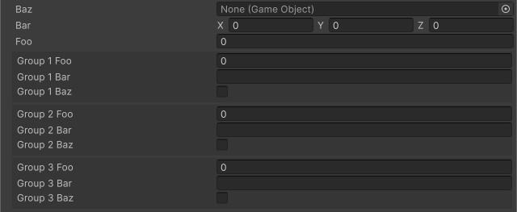

<!-- auto-generated by scripts/docs (dotnet run --project scripts/docs -- generate). Do not edit. -->

# Order Attribute

Changes the display order of the member. The default order is 0, and members are displayed in ascending order. Uses the same scale as group `order`, so ungrouped members and sibling groups interleave by this value.

[!code-csharp]

| Parameter | Description |
| - | - |
| order | The display order of the member. Shares the same scale as group `order`. |
