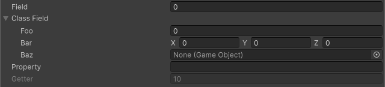

<!-- auto-generated by scripts/docs (dotnet run --project scripts/docs -- generate). Do not edit. -->

# Show In Inspector Attribute

Displays nonserialized fields and properties in the Inspector. Writable members can be edited, but their values are not serialized or persisted.

[!code-csharp]
