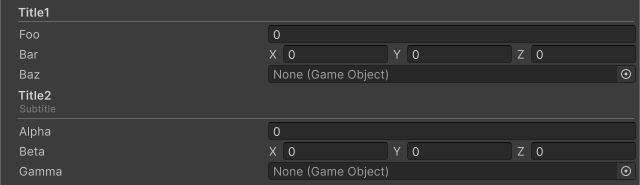

<!-- auto-generated by scripts/docs (dotnet run --project scripts/docs -- generate). Do not edit. -->

# Title Attribute

Displays a header with a separator line in the Inspector.

[!code-csharp]

| Parameter | Description |
| - | - |
| titleText | Text to display in the header. |
| subtitle | Text displayed below the title in smaller font. |
