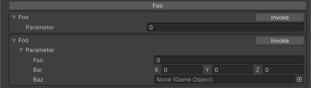

<!-- auto-generated by scripts/docs (dotnet run --project scripts/docs -- generate). Do not edit. -->

# Button Attribute

メソッドを実行可能なボタンをInspectorに表示します。メソッドが引数を持つ場合には、引数を入力可能なフィールドが追加されます。

[!code-csharp]
