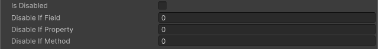

<!-- auto-generated by scripts/docs (dotnet run --project scripts/docs -- generate). Do not edit. -->

# Disable If Attribute

対象のメンバーのbool値がtrueの場合、フィールドが編集不可能になります。

[!code-csharp]

| パラメータ | 説明 |
| - | - |
| condition | 条件の判定に使用するフィールド、プロパティまたはメソッドの名前 |
