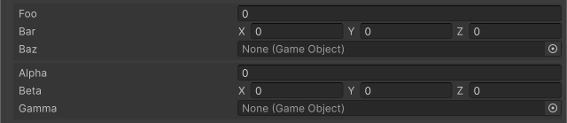

<!-- auto-generated by scripts/docs (dotnet run --project scripts/docs -- generate). Do not edit. -->

# Group Attribute

複数のメンバーをまとめて表示するグループを作成します。

[!code-csharp]

| パラメータ | 説明 |
| - | - |
| groupPath | グループのパスを指定します。グループは`/`で区切ることでネストすることが可能です。 |
| order | 兄弟グループおよびグループ外メンバーとの描画順です。`Order`属性と同じ尺度を使い、値が小さいほど先に描画されます。明示的なorderがないグループはデフォルトで0（順序未指定のメンバーと同じ）になり、同点は宣言順で決まります。ネストしたパス（例: `A/B`）では、末端のグループ（`B`）にのみ適用されます。 |
