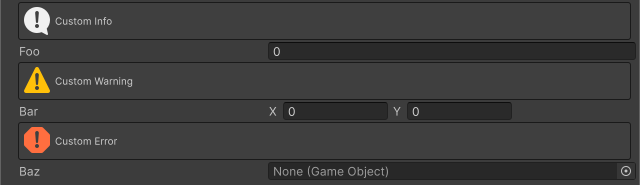

<!-- auto-generated by scripts/docs (dotnet run --project scripts/docs -- generate). Do not edit. -->

# Help Box Attribute

フィールドの上にメモや警告を追加します。

[!code-csharp]

| パラメータ | 説明 |
| - | - |
| message | ボックス内に表示するテキスト |
| messageType | メッセージの種類 |
