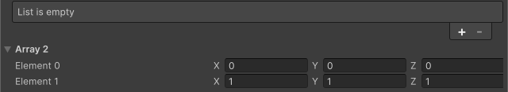

<!-- auto-generated by scripts/docs (dotnet run --project scripts/docs -- generate). Do not edit. -->

# List View Settings Attribute

コレクションの表示に関する設定を変更します。この属性を用いることで行を見やすくしたり、要素数/要素順をInspectorから変更不可能な配列を作成したりすることが可能になります。

[!code-csharp]

| パラメータ | 説明 |
| - | - |
| ShowAddRemoveFooter | 要素の追加/削除を行うフッターを表示するか |
| ShowAlternatingRowBackgrounds | 一行ごとに背景色を変更するかどうか |
| ShowBorder | 境界線を表示するか |
| ShowBoundCollectionSize | 要素数を変更するフィールドを表示するか |
| ShowFoldoutHeader | 折りたたみ可能なヘッダーを表示するか |
| SelectionType | 要素の選択に関する設定 |
| Reorderable | 要素を並び替え可能か |
| ReorderMode | 並び替えの表示に関する設定 |
