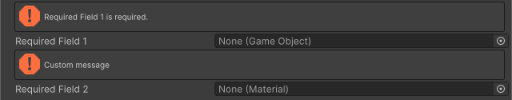

<!-- auto-generated by scripts/docs (dotnet run --project scripts/docs -- generate). Do not edit. -->

# Required Attribute

フィールドにオブジェクトの参照が割り当てられていない場合に警告を表示します。

[!code-csharp]

| パラメータ | 説明 |
| - | - |
| message | 警告に表示するテキスト |
