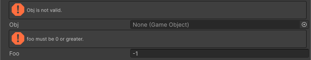

<!-- auto-generated by scripts/docs (dotnet run --project scripts/docs -- generate). Do not edit. -->

# Validate Input Attribute

指定された名前のメンバーの値がfalseである場合に警告を表示します。

[!code-csharp]

| パラメータ | 説明 |
| - | - |
| condition | 値の検証に使用するフィールド、プロパティまたはメソッドの名前 |
| message | 警告に表示するテキスト |
